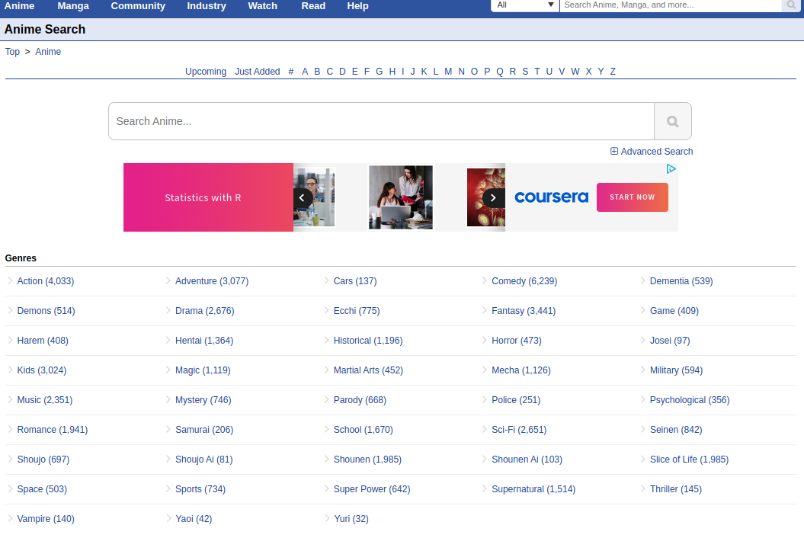

# Anime-score prediction with linear regression
### Note
>This project is made to learn the fundamental of trying to learn how to use pytorch, scrape and process data from webpage. **_This project is by no mean a complete work or working project_**.
### Requirements
This project run on anaconda enivironment, used pytorch for model handling and beautifulsoup for scraping data
- pandas 1.3.0
- beautifulsoup4 4.9.3
- tqdm 4.61.2
- requests 2.26.0
- torch version 1.9.0
### Installation
To install necessary package run  
`pip install -r requirements.txt`

Installing pytorch  
`conda install pytorch torchvision torchaudio cudatoolkit=10.2 -c pytorch`

### Work Flow
#### Scraping data
Data is taken from [MyAnimeList](https://myanimelist.net/)  

As of 07/2021 there are currently 43 genres 

Each anime displayed we focus on the data genres of the current and anime and its score 
| Anime                                  | Genres                                                                                | Scores|
|:--------------------------------------:|:-------------------------------------------------------------------------------------:| -----:|
| Shingeki no Kyojin                     | ['Action', 'Military', 'Mystery', 'Super Power', 'Drama', 'Fantasy', 'Shounen']       | 8.51  |
| Fullmetal Alchemist: Brotherhood       | ['Action', 'Military', 'Adventure', 'Comedy', 'Drama', 'Magic', 'Fantasy', 'Shounen'] | 9.17  |
| Sword Art Online                       | ['Action', 'Game', 'Adventure', 'Romance', 'Fantasy']                                 | 7.22  |
 
To start generating data run  
`python scrape_data.py`

When data is generated, data is saved at csv format in data_dir folder.  
To run predict model run  
`python anime_score_predict.py`

## References
[MyAnimeList user scores: Fun with web scraping and linear regression](https://towardsdatascience.com/myanimelist-user-scores-fun-with-web-scraping-and-linear-regression-9dd97900a82b)
[Scraping Data Using Beautiful Soup and Python](https://blog.jovian.ai/scraping-data-using-beautiful-soup-and-python-4170e7ec63fd)
## Afterword
Through this I gain some basic skills in:  
- Scraping and process data using pandas and beautifulsoup  
- How to buid model using pytorch and its work flow

>Todo:  
> - Applying data analysis to process anime data (currently just using the genres cant show the connection of the anime to the score)
> - The project is still not working as intended and optimized (will take some courses and update the project)
> - Create UI to add genre and print predicted scores
